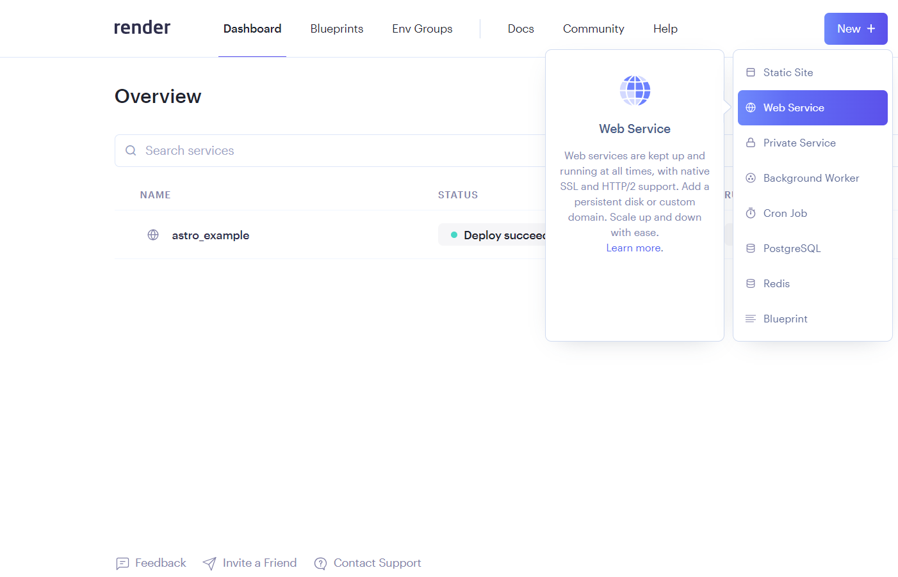
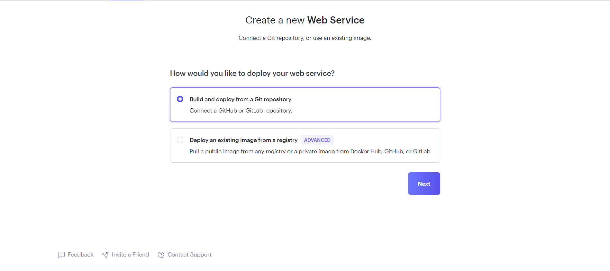
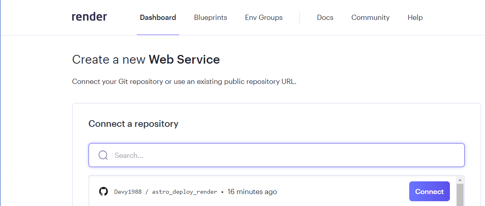
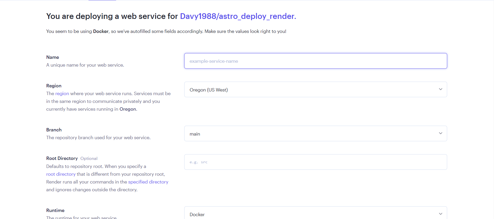

# Deploy astro in render using Docker
Deploying a test application built in Astro using docker in render[https://render.com/].

Just five steps and your astro application will be in production:

1. Create an account in render[https://render.com/].

2. Go to the dashboard, press the new button, select the Web Service option.

3. Select option Build and deploy from a Git repository.

4. Select the repository you want to use to create the service.

5. Fill in the service information, you can fill in the name and go directly to Create Web services at the bottom of the page.

If everything has gone well, your astro application will already be deployed after finishing the deployment of your service. :tada:
